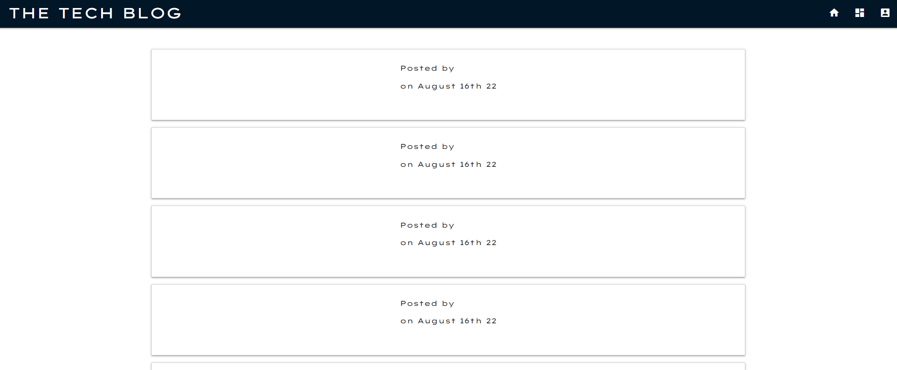
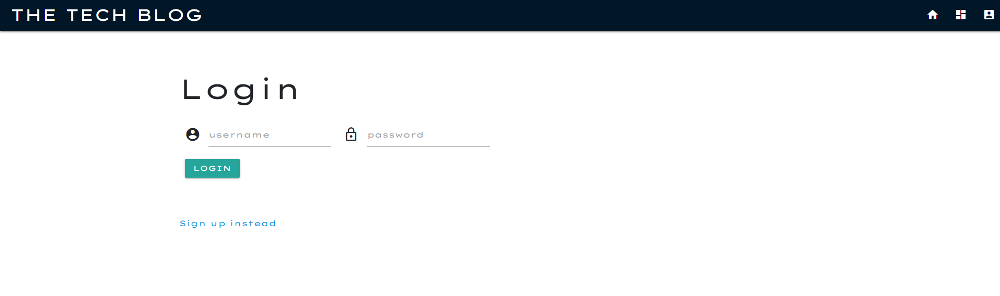
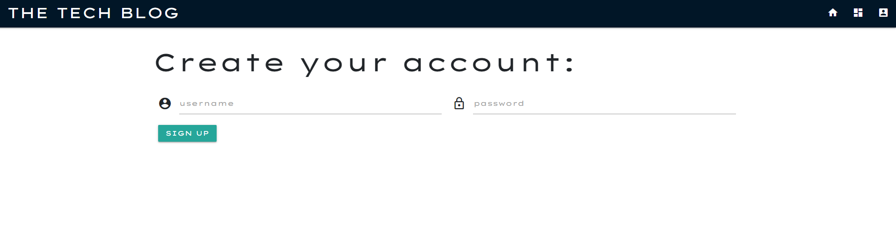
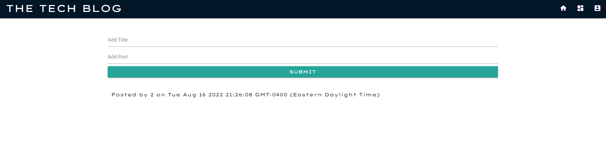

# Model-View-Controller (MVC): Tech Blog

## Description

The Tech Blog is a CMS-style blog where developers can publish their blog posts and comment on other developers' posts as well. Used Handlebars.js instead of HTML as the templating language, Sequelize as the object-relational mapping, and the express-session npm package for authentication.

# Table of Contents

- [Usage](#installation)

- [App's Appearance](#appearance)

- [Contact](#contact)

## Usage

To install all dependencies, run `npm i` in your command line. Run ` node server.js` in the terminal and click on the link provided (http://localhost:3003). You can also visit the site directly by visiting the deployed app link via Heroku: link: https://blooming-shelf-97601.herokuapp.com/.

## Appearance

## Contact

Hiya! If you want to connect or have any questions about this repository, please contact me directly at catacueto@gmail.com. You can find more of my work at https://github.com/catcueto.
